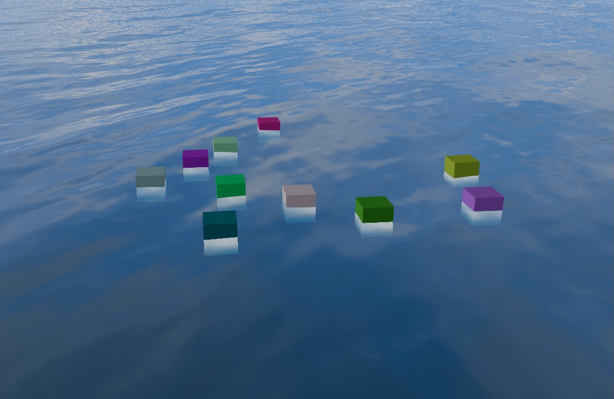

# Buoyancy

The buoyancy system manages floating objects on the water surface with GPU-accelerated sampling and smooth physics.



Access via `water.buoyancy`.

## BuoyancyOptions {#options}

Configuration options for buoyant objects:

| Option              | Type            | Default   | Description                                                            |
| ------------------- | --------------- | --------- | ---------------------------------------------------------------------- |
| `heightOffset`      | `number`        | `0`       | Vertical offset. Positive values raise the object above the water     |
| `heightSmoothing`   | `number`        | `0.15`    | Height response time in seconds                                        |
| `multiPoint`        | `boolean`       | `true`    | Use 5-point sampling for pitch/roll dynamics                           |
| `rotationInfluence` | `number`        | `0.5`     | Wave tilt matching (0–1). Only used when `multiPoint: true`            |
| `rotationOffset`    | `THREE.Euler`   | `(0,0,0)` | Neutral orientation on flat water. Only used when `multiPoint: true`   |
| `rotationSmoothing` | `number`        | `0.2`     | Rotation response time in seconds. Only used when `multiPoint: true`   |
| `sampleLength`      | `number`        | auto      | Hull length for pitch (Z axis). Only used when `multiPoint: true`      |
| `sampleOffset`      | `THREE.Vector3` | auto      | Local offset for sampling center. Computed from the bounding-box center when `useBoundingBox: true`; otherwise `(0,0,0)` |
| `sampleWidth`       | `number`        | auto      | Hull width for roll (X axis). Only used when `multiPoint: true`        |
| `useBoundingBox`    | `boolean`       | `true`    | Auto-calculate sample dimensions and center offset from geometry. Only used when `multiPoint: true` |

## Methods {#methods}

### `addObject`

```typescript
addObject(object: THREE.Mesh, options?: BuoyancyOptions): number
```

Add an object to the system. Returns its ID (pass it to the other methods), or `-1` if the object cap is reached.

| Parameter | Type | Description |
| --- | --- | --- |
| `object` | `THREE.Mesh` | The mesh to float on the water surface. |
| `options?` | `BuoyancyOptions` | Per-object buoyancy configuration; omitted fields use defaults. See [BuoyancyOptions](#options). |

### `updateObjectConfig`

```typescript
updateObjectConfig(id: number, options: BuoyancyOptions): boolean
```

Update a registered object's configuration. Returns `true` if the object was found.

| Parameter | Type | Description |
| --- | --- | --- |
| `id` | `number` | The ID returned by `addObject`. |
| `options` | `BuoyancyOptions` | New configuration to apply. See [BuoyancyOptions](#options). |

### `removeObject`

```typescript
removeObject(id: number): boolean
```

Remove an object from the system. Returns `true` if the object was found.

| Parameter | Type | Description |
| --- | --- | --- |
| `id` | `number` | The ID returned by `addObject`. |

### `hasObject`

```typescript
hasObject(id: number): boolean
```

Check whether an object is currently registered.

| Parameter | Type | Description |
| --- | --- | --- |
| `id` | `number` | The ID returned by `addObject`. |

### `getObjectCount`

```typescript
getObjectCount(): number
```

Get the number of registered objects.

### `getCameraWaterHeight`

```typescript
getCameraWaterHeight(): number
```

Get the water height at the camera's position. The camera sample is updated automatically each frame.

### `getSampler`

```typescript
getSampler(): IWaveSampler
```

Get the wave sampler used by the buoyancy system, for other systems that need to sample the water surface directly.

### `getDebugData`

```typescript
getDebugData(): BuoyancyDebugData[]
```

Get per-object debug data (sample points and resolved heights) for visualization.

### `clear`

```typescript
clear(): void
```

Remove all buoyant objects from the system.

## Example

```typescript
import * as THREE from "three/webgpu";

// Ship with multi-point sampling (the default), giving full pitch and roll dynamics.
const shipId = water.buoyancy.addObject(shipMesh, {
  heightOffset: -2,
  rotationInfluence: 0.6,
});

// Override the bounding box with explicit sample dimensions.
const customShipId = water.buoyancy.addObject(shipMesh, {
  heightOffset: -2,
  rotationInfluence: 0.6,
  useBoundingBox: false,
  sampleLength: 30,
  sampleWidth: 8,
  sampleOffset: new THREE.Vector3(0, 0, 5),
});

// Buoy with single-point sampling. It bobs up and down without tilting.
const buoyId = water.buoyancy.addObject(buoyMesh, {
  multiPoint: false,
  heightOffset: 0.5,
});

// Update an object's parameters at runtime.
water.buoyancy.updateObjectConfig(shipId, {
  heightOffset: -1.5,
  rotationInfluence: 0.8,
});

// Remove when done.
water.buoyancy.removeObject(buoyId);
```

## Limits

Buoyancy sampling draws from a shared pool of **128 sample points**. The camera's water-height sample takes one point and is placed after all object points. Each object consumes points according to its mode:

- **Single-point mode** (`multiPoint: false`): 1 sample point per object.
- **Multi-point mode** (`multiPoint: true`, the default): 5 sample points per object, so roughly **25 multi-point objects** fit alongside the camera sample before the pool is exhausted.

`addObject` rejects new objects once **128 objects** are registered, returning `-1`. If the registered objects request more sample points than the pool holds, the surplus points are silently dropped rather than rejected. Because the camera sample sits last in the pool, it is the first point dropped on overflow, so mix single- and multi-point objects with the pool size in mind.
