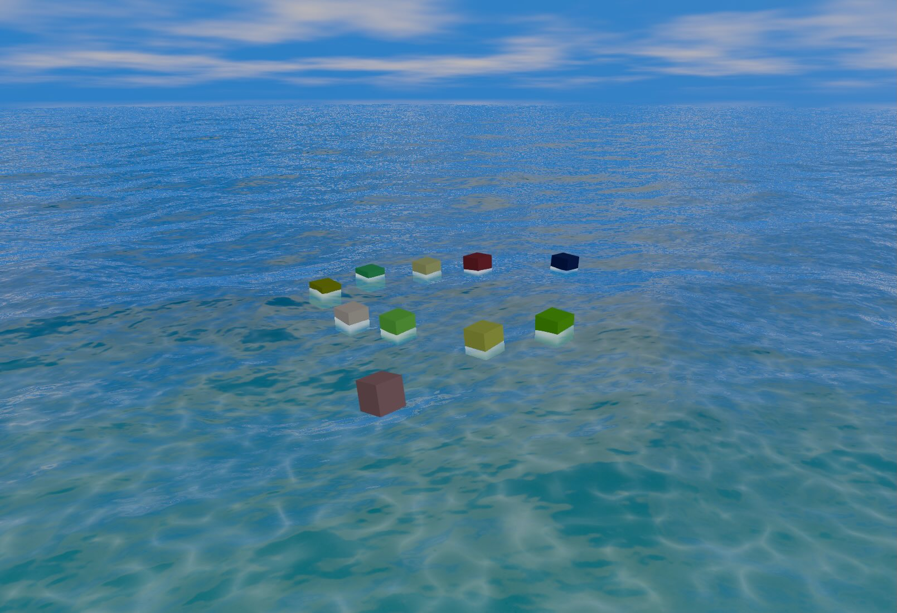

# Basic Example

A step-by-step guide to creating an ocean scene with floating boxes. Choose the approach that best fits your project:

- **[TypeScript + Vite](#typescript-vite)** - Recommended for production apps with bundlers
- **[Plain JavaScript + CDN](#plain-javascript-cdn)** - Quick setup with no build tools

---

## TypeScript + Vite

### Step 1: Create a New Vite Project

```bash
npm create vite@latest my-ocean-project -- --template vanilla-ts
cd my-ocean-project
```

### Step 2: Install Three.js

```bash
npm install three@^0.181.0
npm install --save-dev @types/three@^0.181.0
```

### Step 3: Add the Library

1. Unzip `threejs-water-pro.zip` into your root directory.

2. Create a `threejs-water-pro` sub-directory within your `src` directory.

3. Copy the contents of the `build` directory into the directory you just created.

4. Your file structure should look something like this:

```
my-ocean-project/
├── src/
│   └── threejs-water-pro/
│       ├── index.js      ← Main library bundle
│       ├── index.js.map  ← Source map
│       └── index.d.ts    ← TypeScript declarations
│   └── main.ts
├── index.html
└── package.json
```

### Step 4: Update index.html

Replace the contents of `index.html`:

```html
<!DOCTYPE html>
<html lang="en">
  <head>
    <meta charset="UTF-8" />
    <meta name="viewport" content="width=device-width, initial-scale=1.0" />
    <title>Three.js Water Pro</title>
    <style>
      * {
        margin: 0;
        padding: 0;
        box-sizing: border-box;
      }
      body {
        overflow: hidden;
        background: #000;
      }
      canvas {
        display: block;
      }
    </style>
  </head>
  <body>
    <script type="module" src="/src/main.ts"></script>
  </body>
</html>
```

### Step 5: Write the Main Code

Replace `src/main.ts` with:

```typescript
import * as THREE from "three/webgpu";
import { pass } from "three/tsl";
import { bloom } from "three/addons/tsl/display/BloomNode.js";
import { OrbitControls } from "three/addons/controls/OrbitControls.js";
import { UltraHDRLoader } from "three/addons/loaders/UltraHDRLoader.js";
import { WaterSystem, Sky, getPresetParams } from "./threejs-water-pro";

function setupPostProcessing(
  renderer: THREE.WebGPURenderer,
  water: WaterSystem,
): THREE.PostProcessing {
  const postProcessing = new THREE.PostProcessing(renderer);
  const scenePass = pass(water.scene, water.camera);
  let outputNode: THREE.Node = scenePass.getTextureNode("output");

  // Add water effects (atmospheric fog, underwater haze, sun shafts)
  outputNode = water.postProcessing.buildNode(scenePass, outputNode);

  // Add bloom
  const bloomPass = bloom(outputNode, 0.5, 0.4, 0.85);
  outputNode = outputNode.add(bloomPass);

  postProcessing.outputNode = outputNode;
  return postProcessing;
}

async function main() {
  // Create renderer
  const renderer = new THREE.WebGPURenderer();
  renderer.setSize(window.innerWidth, window.innerHeight);
  renderer.setPixelRatio(Math.min(window.devicePixelRatio, 1));
  renderer.toneMapping = THREE.ACESFilmicToneMapping;
  document.body.appendChild(renderer.domElement);
  await renderer.init();

  // Create scene and camera
  const scene = new THREE.Scene();
  const camera = new THREE.PerspectiveCamera(
    60,
    window.innerWidth / window.innerHeight,
    0.1,
    20000,
  );
  camera.position.set(50, 25, 50);

  // Add orbit controls
  const controls = new OrbitControls(camera, renderer.domElement);
  controls.enableDamping = true;
  controls.dampingFactor = 0.05;

  // Load preset params (used for both water and sky configuration)
  const preset = getPresetParams("dusk");

  // Create water system
  const water = await WaterSystem.create(renderer, scene, camera, "high");
  water.loadPreset(preset);

  // Load an equirectangular HDRI for the sky
  const loader = new UltraHDRLoader();
  const equirect = await loader.loadAsync("sky.jpg");
  equirect.mapping = THREE.EquirectangularReflectionMapping;
  equirect.wrapS = THREE.RepeatWrapping;
  equirect.generateMipmaps = false;
  equirect.minFilter = THREE.LinearFilter;
  equirect.magFilter = THREE.LinearFilter;

  const sky = new Sky({
    equirect,
    sunDirection: water.lighting.sun.direction,
  });
  for (const mesh of sky.getMeshes()) scene.add(mesh);
  water.setSky(sky);

  for (let i = 0; i < 10; i++) {
    const geometry = new THREE.BoxGeometry(4, 4, 4);
    const material = new THREE.MeshStandardMaterial({
      color: new THREE.Color(Math.random(), Math.random(), Math.random()),
    });
    const box = new THREE.Mesh(geometry, material);

    // Position boxes in a scattered pattern
    const angle = (i / 10) * Math.PI * 2;
    const distance = 10 + Math.random() * 25;
    box.position.set(Math.cos(angle) * distance, 0, Math.sin(angle) * distance);

    // Add box to the scene
    scene.add(box);

    // Add to buoyancy system
    water.buoyancy.addObject(box, {
      heightSmoothing: 0.15,
      rotationSmoothing: 0.1,
    });
  }

  // Set up post-processing
  const postProcessing = setupPostProcessing(renderer, water);

  // Handle window resize
  window.addEventListener("resize", () => {
    camera.aspect = window.innerWidth / window.innerHeight;
    camera.updateProjectionMatrix();
    water.resize();
  });

  // Compile shaders before starting animation
  await renderer.compileAsync(scene, camera);

  // Animation loop
  let lastTime = performance.now();

  async function animate() {
    requestAnimationFrame(animate);

    const now = performance.now();
    const deltaTime = (now - lastTime) / 1000;
    lastTime = now;

    controls.update();
    await water.update(deltaTime);
    postProcessing.render();
  }

  animate();
}

main();
```

::: tip Sky image
This example loads an equirectangular HDRI named `sky.jpg` from your project root — supply your own. Free ones are available at [Polyhaven](https://polyhaven.com/hdris) (download the "JPG" / UltraHDR variant to match `UltraHDRLoader`). The water still renders without it, but reflections and atmospheric fog read from the sky.
:::

### Step 6: Run the Project

```bash
npm run dev
```

Open your browser to the URL shown in the terminal (usually `http://localhost:5173`).

---

## Plain JavaScript + CDN

This approach uses import maps to load Three.js from a CDN, with no build tools required.

### Step 1: Create Project Files

Create a folder with the following structure:

```
my-ocean-project/
├── lib/
├── src/
│   └── main.js
└── index.html
```

### Step 2: Add the Library

1. Unzip `threejs-water-pro.zip`

2. Copy `build/index.js` into your `lib` folder.

3. _Optional_: If you want source maps, also copy `build/index.js.map` into your `lib` folder.

### Step 3: Create index.html

Three.js Water Pro uses Three.js as a dependency. You will need to import Three.js via CDN using an import map.

```html
<!DOCTYPE html>
<html lang="en">
  <head>
    <meta charset="UTF-8" />
    <meta name="viewport" content="width=device-width, initial-scale=1.0" />
    <title>Three.js Water Pro</title>
    <style>
      * {
        margin: 0;
        padding: 0;
        box-sizing: border-box;
      }
      body {
        overflow: hidden;
        background: #000;
      }
      canvas {
        display: block;
      }
    </style>

    <!-- Import map for Three.js CDN -->
    <script type="importmap">
      {
        "imports": {
          "three": "https://cdn.jsdelivr.net/npm/three@0.181.0/build/three.webgpu.min.js",
          "three/webgpu": "https://cdn.jsdelivr.net/npm/three@0.181.0/build/three.webgpu.min.js",
          "three/tsl": "https://cdn.jsdelivr.net/npm/three@0.181.0/build/three.tsl.min.js",
          "three/addons/": "https://cdn.jsdelivr.net/npm/three@0.181.0/examples/jsm/"
        }
      }
    </script>
  </head>
  <body>
    <script type="module" src="./src/main.js"></script>
  </body>
</html>
```

### Step 4: Create main.js

```javascript
import * as THREE from "three/webgpu";
import { pass } from "three/tsl";
import { bloom } from "three/addons/tsl/display/BloomNode.js";
import { OrbitControls } from "three/addons/controls/OrbitControls.js";
import { UltraHDRLoader } from "three/addons/loaders/UltraHDRLoader.js";
import { WaterSystem, Sky, getPresetParams } from "../lib/index.js";

function setupPostProcessing(renderer, water) {
  const postProcessing = new THREE.PostProcessing(renderer);
  const scenePass = pass(water.scene, water.camera);
  let outputNode = scenePass.getTextureNode("output");

  // Add water effects (atmospheric fog, underwater haze, sun shafts)
  outputNode = water.postProcessing.buildNode(scenePass, outputNode);

  // Add bloom
  const bloomPass = bloom(outputNode, 0.5, 0.4, 0.85);
  outputNode = outputNode.add(bloomPass);

  postProcessing.outputNode = outputNode;
  return postProcessing;
}

async function main() {
  // Create renderer
  const renderer = new THREE.WebGPURenderer();
  renderer.setSize(window.innerWidth, window.innerHeight);
  renderer.setPixelRatio(Math.min(window.devicePixelRatio, 1));
  renderer.toneMapping = THREE.ACESFilmicToneMapping;
  document.body.appendChild(renderer.domElement);
  await renderer.init();

  // Create scene and camera
  const scene = new THREE.Scene();
  const camera = new THREE.PerspectiveCamera(
    60,
    window.innerWidth / window.innerHeight,
    0.1,
    20000,
  );
  camera.position.set(50, 25, 50);

  // Add orbit controls
  const controls = new OrbitControls(camera, renderer.domElement);
  controls.enableDamping = true;
  controls.dampingFactor = 0.05;

  // Load preset params (used for both water and sky configuration)
  const preset = getPresetParams("dusk");

  // Create water system
  const water = await WaterSystem.create(renderer, scene, camera, "high");
  water.loadPreset(preset);

  // Load an equirectangular HDRI for the sky
  const loader = new UltraHDRLoader();
  const equirect = await loader.loadAsync("sky.jpg");
  equirect.mapping = THREE.EquirectangularReflectionMapping;
  equirect.wrapS = THREE.RepeatWrapping;
  equirect.generateMipmaps = false;
  equirect.minFilter = THREE.LinearFilter;
  equirect.magFilter = THREE.LinearFilter;

  const sky = new Sky({
    equirect,
    sunDirection: water.lighting.sun.direction,
  });
  for (const mesh of sky.getMeshes()) scene.add(mesh);
  water.setSky(sky);

  for (let i = 0; i < 10; i++) {
    const geometry = new THREE.BoxGeometry(4, 4, 4);
    const material = new THREE.MeshStandardMaterial({
      color: new THREE.Color(Math.random(), Math.random(), Math.random()),
    });
    const box = new THREE.Mesh(geometry, material);

    // Position boxes in a scattered pattern
    const angle = (i / 10) * Math.PI * 2;
    const distance = 10 + Math.random() * 25;
    box.position.set(Math.cos(angle) * distance, 0, Math.sin(angle) * distance);

    // Add box to the scene
    scene.add(box);

    // Add to buoyancy system
    water.buoyancy.addObject(box, {
      heightSmoothing: 0.15,
      rotationSmoothing: 0.1,
    });
  }

  // Set up post-processing
  const postProcessing = setupPostProcessing(renderer, water);

  // Handle window resize
  window.addEventListener("resize", () => {
    camera.aspect = window.innerWidth / window.innerHeight;
    camera.updateProjectionMatrix();
    water.resize();
  });

  // Compile shaders before starting animation
  await renderer.compileAsync(scene, camera);

  // Animation loop
  let lastTime = performance.now();

  async function animate() {
    requestAnimationFrame(animate);

    const now = performance.now();
    const deltaTime = (now - lastTime) / 1000;
    lastTime = now;

    controls.update();
    await water.update(deltaTime);
    postProcessing.render();
  }

  animate();
}

main();
```

::: tip Sky image
This example loads an equirectangular HDRI named `sky.jpg` — supply your own (e.g. from [Polyhaven](https://polyhaven.com/hdris), the "JPG" / UltraHDR variant) and place it where your server can reach it. The water still renders without it, but reflections and atmospheric fog read from the sky.
:::

### Step 5: Serve the Files

You need a local web server since browsers block ES modules loaded via `file://`. Use any of these:

```bash
# Using Python
python3 -m http.server 8080

# Using Node.js (npx)
npx serve .

# Using PHP
php -S localhost:8080
```

Open `http://localhost:8080` in your browser.

Alternatively, if you are using VS Code, you can install an extension like Live Server for development.

::: warning CORS Note
Import maps with CDN URLs require the page to be served over HTTP/HTTPS. Opening `index.html` directly as a file won't work.
:::

---

## Result

After running the app, you should see several boxes floating on the water.



## Next Steps

- [Presets](/guide/presets) - Try different ocean environments
- [Floating Objects](/guide/floating-objects) - More buoyancy options
- [WaterSystem API](/api/water-system) - Full API reference
