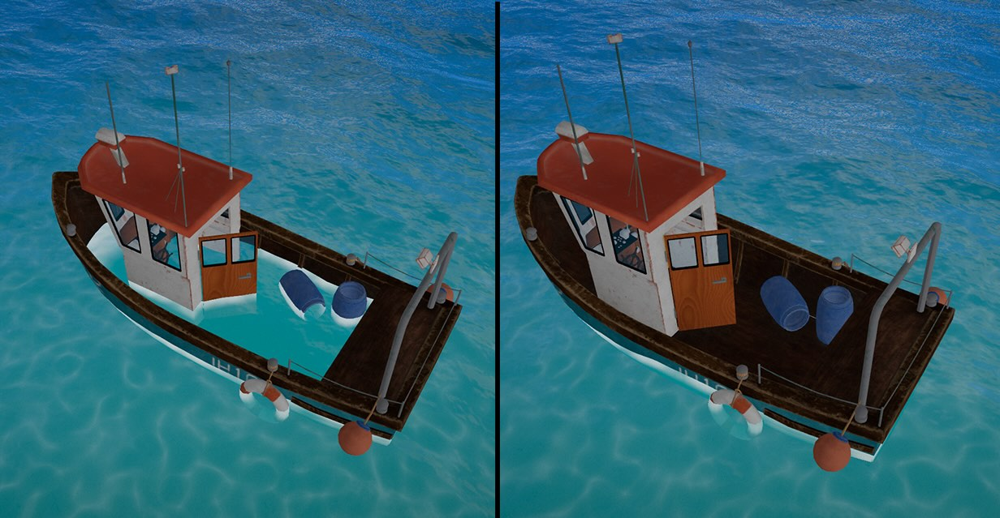

# Water Masking

Hide water in specific screen areas using mask meshes.


_Left image: water mask disabled. Right image: water mask enabled_

## Overview

Water masking allows you to hide water rendering inside objects like boat hulls, submarine interiors, or any enclosed space where water shouldn't be visible. This works by rendering mask meshes to a screen-space texture, then discarding water fragments where the mask is present.

## Basic Usage

```typescript
// Create mask mesh (e.g., boat hull interior)
const hullMask = new THREE.Mesh(
  new THREE.BoxGeometry(10, 5, 20),
  new THREE.MeshBasicMaterial(),
);
hullMask.position.copy(boat.position);

// Add as water mask
water.masking.add(hullMask);

// Later: remove mask
water.masking.remove(hullMask);
```

See the [Masking API](/api/masking) for the full property and method reference.

## Creating Effective Masks

### Mask Mesh Guidelines

1. **Set `visible: false`**: Mask meshes should have `visible = false` so they don't render in the main scene. The MaskPass will temporarily make them visible only when rendering to the mask texture.

2. **Simplified geometry**: Mask meshes should be simplified versions of the interior space. They don't need to match the visual mesh exactly.

3. **Slightly larger**: Make mask meshes slightly larger than the actual interior to prevent edge artifacts.

4. **Any material works**: Mask meshes are rendered with an override material, so their actual material doesn't affect the result.

5. **Position synchronization**: Parent mask meshes to their associated objects for automatic transform updates.

### Boat Hull Example

```typescript
// Load boat model
const boat = await loadBoatModel();
scene.add(boat);

// Create simplified hull interior mask
const hullMask = new THREE.Mesh(
  new THREE.BoxGeometry(8, 3, 15),
  new THREE.MeshBasicMaterial(),
);

// Position mask inside hull and hide from main render
hullMask.position.set(0, -1, 0);
hullMask.visible = false;
boat.add(hullMask); // Parent to boat for automatic transforms

// Register as water mask
water.masking.add(hullMask);
```

### Complex Interiors

For complex interiors, use multiple mask meshes:

```typescript
// Ship with multiple compartments
const bridgeMask = createBridgeMask();
const cargoBayMask = createCargoBayMask();
const engineRoomMask = createEngineRoomMask();

ship.add(bridgeMask);
ship.add(cargoBayMask);
ship.add(engineRoomMask);

water.masking.add(bridgeMask);
water.masking.add(cargoBayMask);
water.masking.add(engineRoomMask);
```

## Performance Considerations

- Mask rendering adds a small GPU cost per frame
- Use simple geometry for masks (boxes, cylinders) rather than complex meshes
- Masking is automatically skipped when no masks are registered
- Masks are rendered to a screen-space texture, so the cost scales with screen resolution, not mask complexity

## Troubleshooting

### Water still visible inside mask

- Ensure mask mesh completely covers the interior from all viewing angles
- Try making the mask slightly larger
- Check that the mask is properly positioned relative to the parent object

### Mask edges visible

- Use a slightly oversized mask
- Ensure mask geometry has no gaps

### Performance issues

- Simplify mask geometry
- Use fewer, larger masks instead of many small ones
